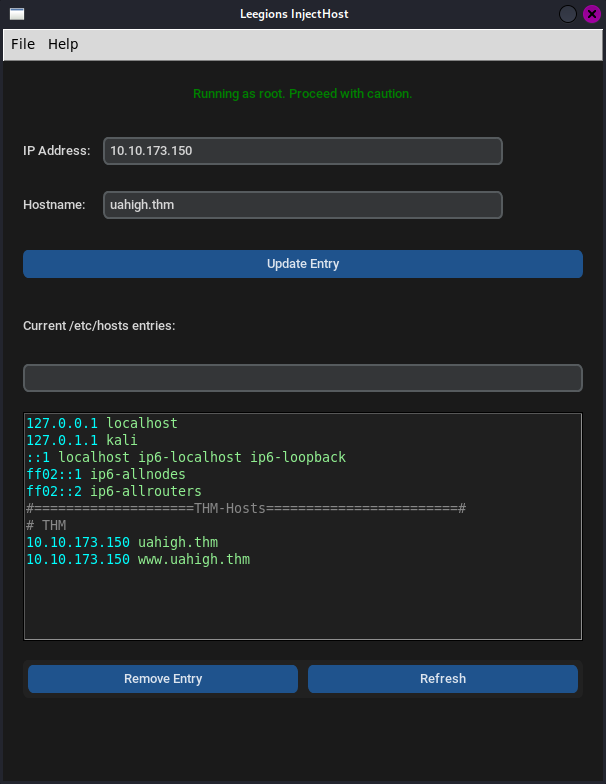

# 🌐 Leegion InjectHost

**Advanced Hosts File Management Tool with CLI and GUI**

A comprehensive tool for managing `/etc/hosts` files with advanced features including network utilities, configuration management, validation & linting, and more.



## ✨ Features

### 🔧 Core Functionality
- **Add/Remove/Update** host entries with validation
- **Batch operations** for multiple entries
- **Search and filter** host entries
- **Automatic backups** before modifications
- **Real-time validation** of IP addresses and hostnames
- **Statistics and reporting** of hosts file content

### 🌐 Network Utilities
- **DNS cache flushing** for immediate effect
- **Host connectivity testing** (ping, HTTP, HTTPS)
- **Network scanning** for active hosts
- **SSL certificate information** retrieval
- **Hostname resolution testing**
- **Network diagnostics** and troubleshooting

### 📁 Configuration Management
- **Save/load configurations** for different environments
- **Configuration templates** for common scenarios
- **Import/export** configurations to files
- **Rename and describe** configurations
- **Quick apply** configurations with backup
- **Configuration statistics** and metadata

### 🔍 Advanced Validation & Linting
- **Comprehensive validation** of hosts file syntax
- **IPv4 & IPv6 address validation**
- **Duplicate detection** (IPs and hostnames)
- **Format consistency checking** (spacing, tabs, etc.)
- **Automatic formatting** with consistent styling
- **Detailed validation reports** with suggestions
- **Real-time linting** with actionable feedback

### 🎨 Modern GUI
- **Dark theme** with professional appearance
- **Responsive layout** with two-column design
- **Color-coded buttons** for different actions
- **Real-time search** and filtering
- **Syntax highlighting** in hosts display
- **Integrated validation tools**
- **Network tools window**
- **Configuration management interface**

## 🚀 Quick Start

### Installation

```bash
# Clone the repository
git clone https://github.com/yourusername/Leegoins-InjectHost.git
cd Leegoins-InjectHost

# Install with sudo (required for hosts file access)
sudo python3 install.py
```

### Usage

```bash
# CLI version
sudo injecthost

# GUI version
sudo injecthost-gui
```

## 📖 CLI Commands

### Basic Operations
```bash
# Add a host entry
sudo injecthost add 192.168.1.100 myserver.local

# Remove a host entry
sudo injecthost remove 192.168.1.100 myserver.local

# Update a host entry
sudo injecthost update 192.168.1.100 myserver.local 192.168.1.101 newserver.local

# List all entries
sudo injecthost list

# Batch add from file
sudo injecthost batch-add hosts.txt
```

### Network Tools
```bash
# Flush DNS cache
sudo injecthost flush-dns

# Test host connectivity
sudo injecthost test

# Scan local network
sudo injecthost scan 192.168.1
```

### Configuration Management
```bash
# Save current hosts as configuration
sudo injecthost config save "production" --description "Production environment"

# List configurations
sudo injecthost config list

# Apply configuration
sudo injecthost config apply "production"

# Export configuration
sudo injecthost config export "production" production_hosts.txt

# Import configuration
sudo injecthost config import hosts_backup.txt --overwrite
```

### Validation & Linting
```bash
# Validate hosts file
sudo injecthost validate

# Detailed validation report
sudo injecthost validate --detailed

# Format hosts file
sudo injecthost format
```

## 🎯 GUI Features

### Main Interface
- **Add/Edit Section**: Input fields for IP and hostname with validation
- **Quick Actions**: Search, refresh, and clear functions
- **Hosts Display**: Real-time view of current hosts file with syntax highlighting
- **Menu System**: Access to all advanced features

### Network Tools Window
- **DNS Flush**: Clear DNS cache for immediate effect
- **Host Testing**: Test connectivity, ping, and HTTP/HTTPS
- **Network Scanning**: Discover active hosts on local network
- **Real-time Output**: Threaded operations with live feedback

### Configuration Manager
- **Configuration List**: View all saved configurations
- **Create/Edit**: Save current hosts with name and description
- **Apply Configurations**: Switch between different setups
- **Import/Export**: Share configurations between systems

### Validation Window
- **Run Validation**: Basic validation with summary
- **Detailed Report**: Comprehensive analysis with file statistics
- **Format File**: Auto-format with consistent styling
- **Issue Tracking**: Line-by-line validation with suggestions

## 🛠️ Architecture

### Core Components
- **`injecthost_logic.py`**: Business logic and validation
- **`repository.py`**: Data access layer with caching
- **`models.py`**: Data models and validation
- **`config.py`**: Configuration management
- **`validation.py`**: Advanced validation and linting

### GUI Components
- **`injecthost_gui.py`**: Main GUI application
- **`custom_dialogs.py`**: Custom dialog implementations
- **`config_gui.py`**: Configuration management interface

### Network Components
- **`network_utils.py`**: Network utilities and diagnostics
- **`config_manager.py`**: Configuration persistence and management

## 🔧 Requirements

- **Python 3.7+**
- **customtkinter** (auto-installed)
- **Root privileges** (for hosts file access)
- **Linux/Unix system**

## 📋 File Structure

```
Leegoins-InjectHost/
├── injecthost.py              # CLI main application
├── injecthost_gui.py          # GUI main application
├── injecthost_logic.py        # Business logic
├── repository.py              # Data access layer
├── models.py                  # Data models
├── config.py                  # Configuration
├── validation.py              # Validation & linting
├── network_utils.py           # Network utilities
├── config_manager.py          # Configuration management
├── config_gui.py              # Config GUI
├── custom_dialogs.py          # Custom dialogs
├── install.py                 # Installation script
├── uninstall.py               # Uninstallation script
├── injecthost.sh              # CLI wrapper
├── injecthost_wrapper.py      # GUI wrapper
└── README.md                  # This file
```

## 🚨 Security & Ethics

### Important Notes
- **Root privileges required**: This tool modifies system files
- **Backup protection**: Automatic backups before any changes
- **Validation**: All entries validated before modification
- **Ethical use**: Only use on systems you own or have permission to modify

### Best Practices
- Always review changes before applying
- Use configurations for different environments
- Regular validation of hosts file integrity
- Keep backups of important configurations

## 🤝 Contributing

1. Fork the repository
2. Create a feature branch
3. Make your changes
4. Test thoroughly
5. Submit a pull request

## 📄 License

This project is licensed under the MIT License - see the LICENSE file for details.

## 🙏 Acknowledgments

- **customtkinter** for the modern GUI framework
- **Python community** for excellent libraries
- **Security professionals** for feedback and suggestions

---

**⚠️ Disclaimer**: This tool is for educational and legitimate system administration purposes only. Always ensure you have proper authorization before modifying system files.
